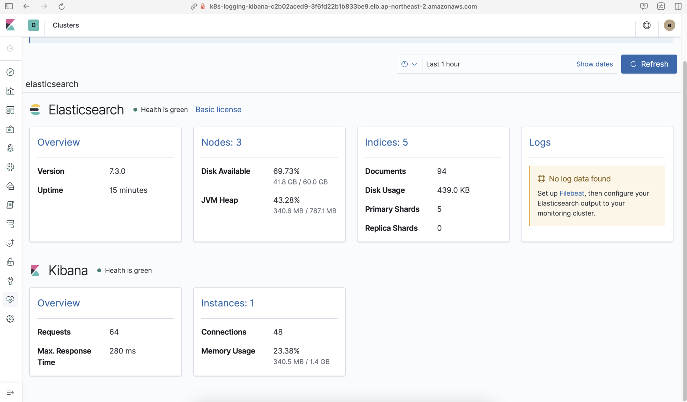
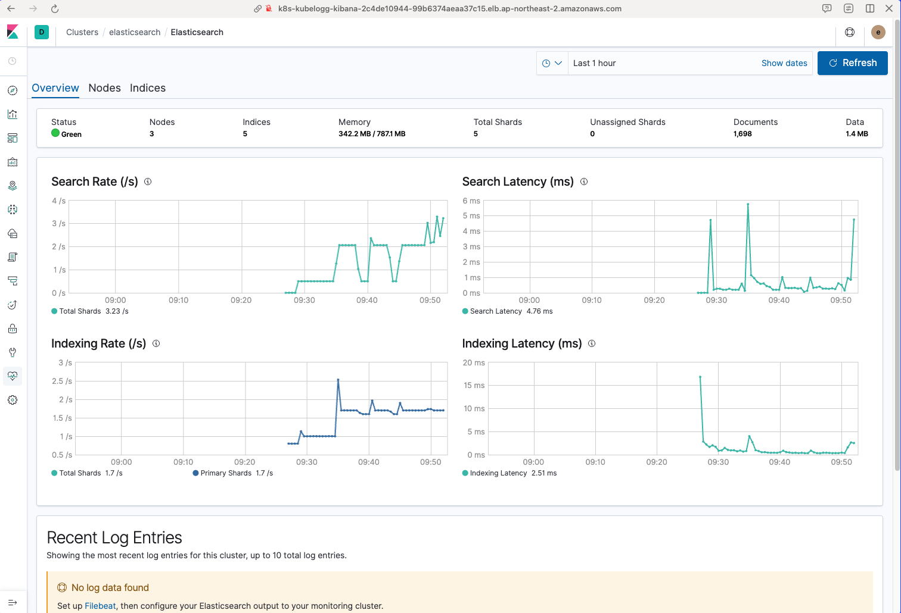
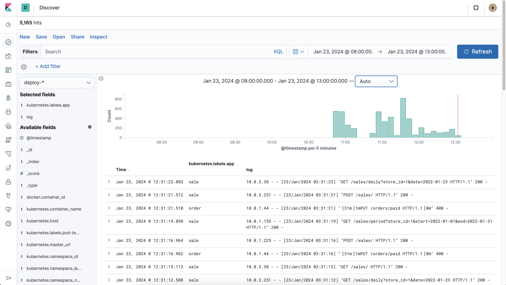
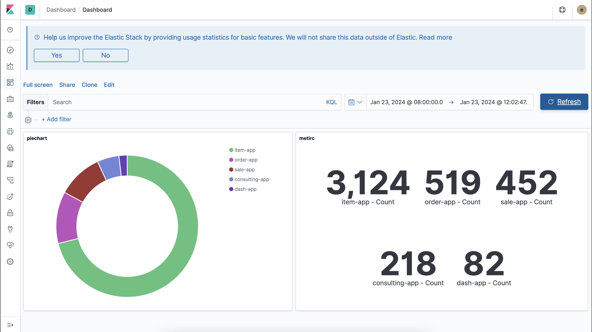
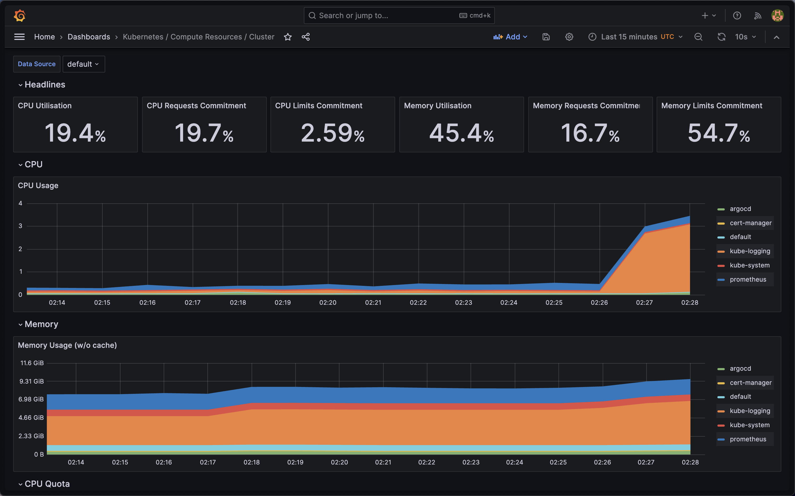

# EFK stack을 이용한 로그 수집 및 분석

## EFK stack

- EFK(Elasticsearch, Fluentd, Kibana)를 통합한 로그 관리 및 분석 솔루션
- 대규모의 로그 데이터를 수집, 저장, 검색, 분석 및 시각화
- 클라우드, 컨테이너화, MSA를 사용하는 환경에 유용

### EFK 스택의 장점

- 중앙화된 로그 관린
    - 다양한 시스템과 애플리케이션에서 발생하는 로그를 중앙 집중식으로 관리 가능
- 확장성
    - 대규모의 데이터와 트래픽을 처리 가능
- 유연성
    - 다양한 데이터 소스와의 호환 및 사용자 요구에 맞춰 커스터마이징 가능
- 실시간 데이터 처리 및 분석
    - 실시간으로 데이터를 수집하고 분석하여 신속한 인사이트 제공
- 강력한 데이터 시각화
    - 복잡한 데이터를 직관적으로 표현 가능

### EFK vs ELK

- 로그 데이터 수집하는 컴포넌트 차이 (Fluentd vs Logstash)
    - Logstash
        - 강력하고 유연한 데이터 처리 기능 제공
        - 리소스 사용량이 높으며 복잡할 수 있다.
    - Fluentd
        - 가볍고 효율적
        - 클라우드 환경이나 컨테이너화된 환경에서 장점을 가진다.
        - Kubernetes와 같은 오케스트레이션 시스템과의 통합 용이
- 사용 적합성
    - ELK 스택
        - 대규모 로그 데이터를 복잡한 파이프라인을 통해 처리해야하는 경우
    - EFK 스택
        - 클라우드 및 컨테이너 환경에서의 로그 관리에 적합

<aside>
💡 MSA 기반 프로젝트로 EKS를 사용하였기에, 클라우드 및 컨테이너화 환경에서 용이한 EFK 스택을 사용하였다.

</aside>

## EFK 스택을 이용한 로그 수집 과정


- Fluentd는 DaemonSet으로 구성한다.
    
    ⇒ 모든 노드에 최소 하나는 실행이 되어야, 모든 pod의 로그를 수집해올 수 있다.
    
- 각 노드에서 수지한 파드의 로그를 Fluentd가 Elasticsearch에 보내 저장한다.
- 수집된 로그를 시각화 및 분석하기 위해 Kibana와 Elasticsearch를 연결한다.

### Elasticsearch

- 실시간 분산 검색 및 분석 엔진
- 로그 데이터의 저장소 역할
- 높은 확장성 및 빠른 검색 기능 제공

Elasticsearch 생성

- master - data- client 순으로 생성
    - master : Elasticsearch 노드의 전체적인 관리하는 곳
    - data :  Elasticsearch에 저장되는 데이터를 보관하는 곳
    - client :  Elasticsearch에 접근할 수 있는 곳



### Fluentd

- 오픈 소스 데이터 수집기
- 가공 및 변환 과정 이후 Elasticsearch로 전달
- 플러그인 구조로 설계되어 있어 다양한 입력 및 출력 소스를 지원하며, 효율적인 메모리 사용과 높은 확장성 제공

로그 수집 과정

```yaml
<source>
      @type tail
      path /var/log/containers/deploy-*_default_*.log
      pos_file /var/log/fluentd-containers.log.pos
      tag kubernetes.*
      format json
      read_from_head true
      <parse>
        @type regexp
        expression /^(?<time>\d{4}-\d{2}-\d{2}T\d{2}:\d{2}:\d{2}\.\d+Z) (stderr|stdout) F (?<log>.*)$/
        time_format %Y-%m-%dT%H:%M:%S.%NZ
      </parse>
    </source>
```

- containers 중 deploy-*_default_*.log 형식인 로그를 모두 수집

```yaml
filter kubernetes.**>
      @type grep
      <regexp>
        key log
        pattern /HTTP\/1.1/
      </regexp>
      <exclude>
        key log
        pattern /GET \/ HTTP\/1.1/
      </exclude>    
    </filter>
```

- Health Check인 "GET / HTTP/1.1" 200 - 를 제외하기 위해 `/GET \/ HTTP\/1.1/` 를 통해 제외시킨다.
- 500 Internal Server Error의 경우 오류 로그가 수집되지 않게 `/HTTP\/1.1/`로 api 요청에 따른 로그만 수집한다.

### Kibana

- Elasticsearch에 저장된 데이터를 시각화하고 탐색하는 웹 기반 인터페이스를 제공
- 데이터 분석 및 데이터 시각화

데이터 시각화

- Index Pattern에서 deploy-*를 통해 모든 서비스의 로그를 한 번에 수집한다.



- Visualize을 통해 시각화 그래프를 생성



### TroubleShooting

- Fluentd의 conf파일을 잘목 작성해서 발생한 문제
    - 노드안에 존재하는 모든 파드의 로그를 수집해오는데, 더미 데이터들이 오면서 생긴 문제
    - 모든 파드의 더미 로그를 수집해오며 노드에 부하 발생
    - conf파일에서 수집 대상의 컨테이너를 지정 - deploy_*default*_.log

